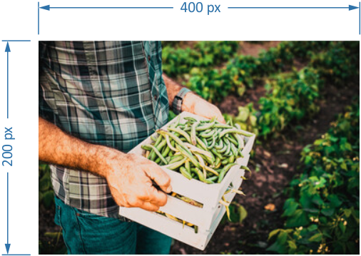
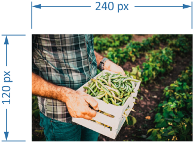
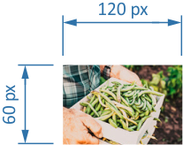

# Raw Image Converter
The Raw Image Converter script is automating the task of converting and resizing bulks of images.

It is based on the "Image Processor" Adobe ExtendScript script written by Tom Ruark, Dr. Russell
Preston Brown and the beautiful UI design by Julie Meridian.

This repository's Raw Image Converter script is a complete rework. It no longer is a procedural script
the original Image Processor script was. The original script was a long concatenation of global
variables and functions, bloating the namespace with loads of identifiers that may lead to potential
naming conflicts.

This new Raw Image Converter script provides enhanced code quality. It is written in an object
oriented style with the `strict` compiling option enabled, adhering to
[SOLID](https://en.wikipedia.org/wiki/SOLID) programming principles. It comprises of dedicated
objects, encapsulated variables and reusable components. I furthermore split each of the objects
into separate files, so each object may easily be reused, maintained, tested and adapted to new
requirements.

In the course of the redo, I fixed some minor bugs and replaced the original (and, as I believe,
rather useless) "crop to upper left" feature with two rather interesting features: resizing and
cropping the images based on their original image size and center point.

## Raw Image Converter comes with some great new features

- Export to PNG file format added.
- Images may be resized to a percentage of their original size in order to
create thumbnails.
- Images may be cropped around their center point at a percentage of their
original size in order to remove bleed from the images.
- Author information may be set in image metadata.

## How to install

Simply clone this GitHub repository to your local drive. All necessary files will be in place then.

## How to use

1. Open Photoshop.
1. Select menu item **File > Scripts > Browse…**
1. Locate "**Raw Image Converter.jsx**" file at the location you've cloned this repository to.
1. Either select folder location of images to be converted, or choose "**Use Open Images**" option
   to convert files that are open in Photoshop.
1. Select target folder to store converted images to.
1. Set options of features you'd like to be run in the Raw Image Converter Settings dialog.
1. Hit "**Run**" button.

   

### Details

- Choose to have the script either open images from a file folder (optionally recursively)
  or use images currently open in Photoshop.
- A set of Camera Raw settings may be applied to all images by checking the
  "**Open first image to apply settings**" option.
- Select a destination folder to have the resulting images stored. Optionally, the source files'
  folder structure may be retained. Alternatively, all images get saved into a single folder.
- Existing files won't be overwritten. A unique name suffix will be generated if a file in
  the destination folder already exists.
- The resulting files may be saved in any of the following four formats:
  - JPEG
  - PNG
  - PSD
  - TIFF
- Individual options are available for all four file formats.
- Optionally resize the resulting images by selecting a factor for resizing and cropping.
- Photoshop Actions may be applied to all images.
- Author and copyright information may be added/changed to the resulting images
  and the ICC profile may be optionally saved along.
- Hit "**Run**" to execute the script. This will open the images using Camera Raw, apply all
  selected changes and save the result. Your current settings will be saved and restored the
  next time your open Raw Image Converter.
- Hit "**Cancel**" to close the script without performing any action.
- Hit "**Load…**" to save current settings to a custom location.
- Hit "**Save…**" to restore previously saved settings from a custom location.

### Resizing and cropping

You may optionally resize all images by a certain factor. The range for this factor ranges from 5 % of
original size (i.e. thumbnail size) to 100 % of original size (which in fact doesn't resize the image at all).

You can also crop the border of all images by a certain factor. The range for this factor ranges from 5 %
of original size (i.e. keep only the extreme center part of an image) to 100 % of original size (which in fact doesn't crop
the image at all).

#### Example

Provided we have the following source image:

Having it resized to a factor of 60 % results in the following output:

Having it also cropped by 50 % results in the following output:

## Implementation Details

For this script to be applicable to as many users as possible, I reused many of the localized
texts from Image Processor. However, some additional texts were required for this script. I
added English and German versions for those texts. Any contributions for adding additional
localizations to my texts in [`_Strings.jsx`](includes/RawImageConverter/_Strings.jsx) are very welcome!

I stored all reusable components in the `./includes` subfolder and prefixed their file name with an
underscore to designate them as being a "not executable, yet reusable component". Components particular
to Raw Image Converter I stored at `./includes/RawImageConverter/`. I prefixed their file names with
an underscore, too, to designate them as being "non executable".